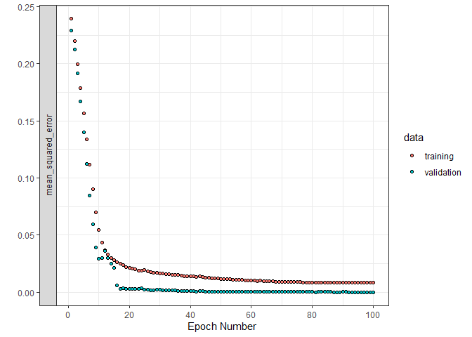

<!-- README.md is generated from README.Rmd. Please edit that file -->
FuncNN
======

<!-- badges: start -->
<!-- badges: end -->
This package allows the user to build models of the form: f(z, g(x) | θ) where f() is a neural network, z is a vector of scalar covariates, and g(x) is a vector of functional covariates. The package is built on top of the Keras/Tensorflow architecture.

For more information on the methodology: <https://arxiv.org/abs/2006.09590>

Installation
------------

You can install the released version of FuncNN from [CRAN](https://CRAN.R-project.org) with:

``` r
#install.packages("FuncNN")
```

You can install `FuncNN` from GitHub with the following commands:

``` r
library(devtools)
install_github("b-thi/FuncNN")
```

Example
-------

The package functions can be as simple (or complicated) as you want them to be! To illustrate, we'll use the classic Tecator meat sample dataset for a classification problem.

First, we'll read in the data and load some libraries.

``` r
# Library
library(FuncNN)

# Loading data
tecator = FuncNN::tecator
```

We'll do a classification example using meat samples with fat contents &gt; 25 as "high fat" and &lt; 25 as "low fat" as the dependent variable.

``` r
# Making classification bins
tecator_resp = as.factor(ifelse(tecator$y$Fat > 25, 1, 0))
```

We have our response, what about our predictors? Well, to keep it simple, let's first consider our scalar covariates; we'll use the water contents of the meat samples as a scalar covariate

``` r
# Non functional covariate
tecator_scalar = data.frame(water = tecator$y$Water)
```

Let's now add some functional covariates:

``` r
# Splitting data
ind = sample(1:length(tecator_resp), round(0.75*length(tecator_resp)))
train_x = tecator$absorp.fdata$data[ind,]
test_x = tecator$absorp.fdata$data[-ind,]
scalar_train = data.frame(tecator_scalar[ind,1])
scalar_test = data.frame(tecator_scalar[-ind,1])
train_y = tecator_resp[ind]
test_y = tecator_resp[-ind]
```

In the chunk of code above, I split the absorbance curves into a test and train set with a 25/75 split. Since we are doing this the "easy" way, we won't need to do any pre-processing on the raw absorbance points (of each meat sample). I also split the previously defined scalar covariates and response in the same way.

Before fitting the model, we need to get the functional covariates in the proper format (okay, so there is a little bit of processing). In the case where we are passing in the raw curve points, we need to pass them in as a list of K dimensions where K is the number of functional covariates. In the situation at hand, we only have one functional covariate so our list will have one element:

``` r
# Making list element to pass in
func_covs_train = list(train_x)
func_covs_test = list(test_x)
```

Now we can fit the model!

``` r
# Now running model
fit_class = fnn.fit(resp = train_y,
                    func_cov = func_covs_train,
                    scalar_cov = scalar_train,
                    hidden_layers = 6,
                    neurons_per_layer = c(24, 24, 24, 24, 24, 58),
                    activations_in_layers = c("relu", "relu", "relu", "relu", "relu", "linear"),
                    domain_range = list(c(850, 1050)),
                    learn_rate = 0.001,
                    epochs = 100,
                    raw_data = T,
                    early_stopping = T)
#> [1] "Evaluating Integrals:"
#> Model
#> Model: "sequential"
#> ___________________________________________________________________________
#> Layer (type)                     Output Shape                  Param #     
#> ===========================================================================
#> dense (Dense)                    (None, 24)                    216         
#> ___________________________________________________________________________
#> dense_1 (Dense)                  (None, 24)                    600         
#> ___________________________________________________________________________
#> dense_2 (Dense)                  (None, 24)                    600         
#> ___________________________________________________________________________
#> dense_3 (Dense)                  (None, 24)                    600         
#> ___________________________________________________________________________
#> dense_4 (Dense)                  (None, 24)                    600         
#> ___________________________________________________________________________
#> dense_5 (Dense)                  (None, 58)                    1450        
#> ___________________________________________________________________________
#> dense_6 (Dense)                  (None, 2)                     118         
#> ===========================================================================
#> Total params: 4,184
#> Trainable params: 4,184
#> Non-trainable params: 0
#> ___________________________________________________________________________
#> 
#> 
#> 
#> xxxxxxxxxxxxxxxxxxxxxxxxxxxxxxxxxxxxxxxxxxxxxxxxxxxxxxxxxxxxxxxxxxxxxxxxxxxxxxxx
#> xxxxxxxxxxxxxxxxxxxx
```



    #> 
    #> Trained on 128 samples (batch_size=32, epochs=100)
    #> Final epoch (plot to see history):
    #>                   loss: 0.008045
    #>     mean_squared_error: 0.008045
    #>               val_loss: 0.000001007
    #> val_mean_squared_error: 0.000001007

Here, we fit a 6 layer model. There are a number of warnings and error checks in place to make sure that all the dimensionality is consistent. The first three inputs are all objects we defined above! Also, observe that raw\_data is true here; this is important to indicate as it tells the model function to do the pre-processing.

Now that we have our model, we can make some predictions:

``` r
# Running prediction
predict_class = fnn.predict(fit_class,
                            func_cov = func_covs_test,
                            scalar_cov = scalar_test,
                            domain_range = list(c(850, 1050)),
                            raw_data = T)

# Rounding predictions (they are probabilities)
rounded_preds = ifelse(round(predict_class)[,2] == 1, 1, 0)

# Confusion matrix
caret::confusionMatrix(as.factor(rounded_preds), as.factor(test_y))
#> Confusion Matrix and Statistics
#> 
#>           Reference
#> Prediction  0  1
#>          0 39  0
#>          1  0 15
#>                                     
#>                Accuracy : 1         
#>                  95% CI : (0.934, 1)
#>     No Information Rate : 0.7222    
#>     P-Value [Acc > NIR] : 2.335e-08 
#>                                     
#>                   Kappa : 1         
#>                                     
#>  Mcnemar's Test P-Value : NA        
#>                                     
#>             Sensitivity : 1.0000    
#>             Specificity : 1.0000    
#>          Pos Pred Value : 1.0000    
#>          Neg Pred Value : 1.0000    
#>              Prevalence : 0.7222    
#>          Detection Rate : 0.7222    
#>    Detection Prevalence : 0.7222    
#>       Balanced Accuracy : 1.0000    
#>                                     
#>        'Positive' Class : 0         
#> 
```

Not bad.

Okay that's all I have for now, have fun!
